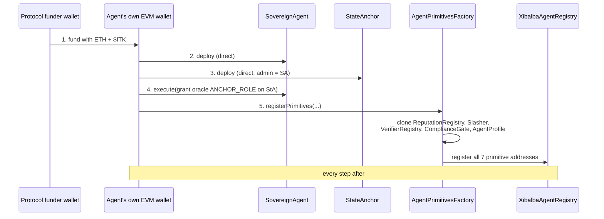

The defining architecture of the Integrity Protocol: **an agent owns and
deploys its own on-chain contracts.** There is no privileged factory that
registers agents into shared global state on their behalf. On registration, an
agent comes to own **7 primitive contracts** — and because the agent's own EVM
wallet signs the deploy transactions for two of them, the chain itself is
cryptographic proof of who controls the identity.

## The 7 primitives

| # | Primitive | Deploy | Role |
|---|---|---|---|
| 1 | `SovereignAgent` | direct (agent's wallet) | Account contract: DID, cached AIS, `execute`, controller rotation |
| 2 | `StateAnchor` | direct (agent's wallet) | Per-agent tamper-evident Merkle-root anchor |
| 3 | `ReputationRegistry` | EIP-1167 clone | Per-agent [AIS](ais.md) ledger + ZK-boost bookkeeping |
| 4 | `Slasher` | EIP-1167 clone | Per-agent $ITK stake / dispute-gated slashing |
| 5 | `VerifierRegistry` | EIP-1167 clone | Per-agent versioned [ZK verifier](zkp.md) pointer |
| 6 | `ComplianceGate` | EIP-1167 clone | Per-agent [regulated-industry gate](compliance-gate.md) |
| 7 | `AgentProfile` | EIP-1167 clone | Per-agent domain membership + metadata |

**2 direct + 5 clones.** The two direct deploys are what make the identity
self-sovereign — signed by the agent's own key. The five clones are cheap
EIP-1167 minimal proxies of shared implementation contracts (~50k gas each vs. a
full deploy), yet each clone is still uniquely owned and controlled by that one
agent.

## Call-routing convention (load-bearing)

Every clone's `DEFAULT_ADMIN_ROLE` is granted to the agent's `SovereignAgent`
**contract** address — never its raw EOA. All post-registration state changes
route through `SovereignAgent.execute(cloneAddr, 0, calldata)`. The single
bootstrap exception is the `AgentPrimitivesFactory.registerPrimitives` call
itself (the SovereignAgent cannot route the call that registers it), which is
EOA-signed and gated by `SovereignAgent.hasRole(DEFAULT_ADMIN_ROLE, msg.sender)`.

`Slasher`'s admin/arbiter is protocol **governance**, never the agent — an agent
cannot be trusted to arbitrate its own slashing dispute.

## Registration sequence

Performed by the [Integrity SDK](../entities/integrity-sdk.md) /
[integrity-cli](../entities/integrity-cli.md), each step signed by the agent's
own wallet (except the initial funding):

1. Fund the agent wallet with ETH + $ITK from the protocol funder wallet.
2. Deploy `SovereignAgent` (direct).
3. Deploy `StateAnchor` (direct), admin = the SovereignAgent contract.
4. Grant the oracle `ANCHOR_ROLE` on the StateAnchor, via `SovereignAgent.execute`.
5. `AgentPrimitivesFactory.registerPrimitives` — clones the 5, registers all 7
   in [`XibalbaAgentRegistry`](../entities/contracts.md).

## Implications

- **Genuinely the operator's identity** — no central party can rotate its
  controller, mint into its reputation, or deregister it.
- **Real cost & irreversibility** — registration spends real gas across ~6
  transactions; the contracts persist on-chain.
- **Resolution, not storage** — per-agent addresses are never in a static
  deployments file; consumers resolve them live from `XibalbaAgentRegistry`
  (the [oracle](../entities/integrity-oracle.md) caches them). See
  [Interface Contract §6](../../INTERFACE_CONTRACT.md).

Related: [contracts](../entities/contracts.md),
[ComplianceGate](compliance-gate.md), [AIS](ais.md).
