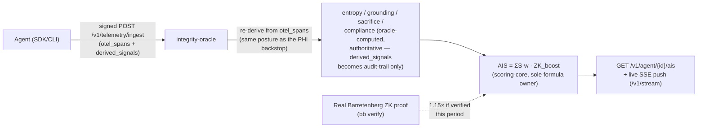

The composite trust score for an agent, computed by [Integrity Oracle](../entities/integrity-oracle.md):

`AIS = (S_entropy*wE + S_grounding*wG + S_sacrifice*wS + S_compliance*wC) * ZK_boost`

Default weights (sum to 1.0): `wE=0.30, wG=0.30, wS=0.20, wC=0.20`.
`ZK_boost = 1.15` when a real Barretenberg proof (see [ZKP](zkp.md)) was
verified for the reporting period, else `1.0`.

This formula is computed in exactly one place (`integrity-oracle/scoring-core`
per the package's own README once built) — other packages read it via the
oracle's `GET /v1/agent/{id}/ais` endpoint rather than recomputing it. See
[Interface Contract §4.3](../../INTERFACE_CONTRACT.md#43-agent-integrity-score-ais)
for the canonical definition. The four component *inputs* the SDK derives
client-side before the oracle applies this formula are documented
separately — see [Local Metrology](local-metrology.md), which also
supersedes an old, inconsistent 3-component draft formula (no compliance
term, weights not summing to 1.0) that never matched this one.

## Where the four inputs actually come from (trust model)

A client's `POST /v1/telemetry/ingest` signature proves *who* sent a request, never
*whether its numbers were honest*. The oracle does not trust the client's
`derived_signals` claim for entropy/grounding/sacrifice — it independently recomputes
all three server-side, from the raw `otel_spans` content already inside the same signed
request (`backend/src/derive.rs`, mirroring `integrity_sdk/telemetry/derive.py`'s
algorithms so results agree), and does the on-chain `ComplianceGate` "wins" check itself
rather than trusting an SDK-side opt-in call. `derived_signals` stays in the signed
envelope (so the wire format hasn't changed) and is still stored, but only as an audit
trail alongside the oracle's own recomputation — it does not feed the formula.

Verified end-to-end, not just unit-tested: a client claiming an inflated grounding score
while its own signed `otel_spans` contain hallucination markers gets the oracle's real,
low recomputation stored and scored — see
`oracle_e2e_recomputed_grounding_overrides_inflated_client_claim` in
`integrity-oracle/backend/tests/e2e.rs`.

**Still open** (see `PRODUCTION_GAPS.md` §1a for the full list): the ZK boost is a
period-wide boolean, not bound to a specific event's claim; TEE/Tier-3 attestation
verification is real but unwired. The oracle-to-chain score push that used to be missing
here now exists — `bcc_middleware`'s `app/reputation.py`/`scoring_loop.py` periodically
pushes each agent's recomputed AIS to `ReputationRegistry.updateScore` and raises
`Slasher.raiseDispute` on a flagged-telemetry threshold (see `PRODUCTION_GAPS.md` §1 and
`docs/INTERFACE_CONTRACT.md` §7a) — this AIS trust hardening now has a live economic
consumer.

`AIS_final = min(S_calculated, Tier_ceiling)` — an identity-verification
ceiling clamp — is a **`[PLANNED]`** design, not implemented in
`scoring-core` today; see [Identity Ceiling](identity-ceiling.md).

Related: [Behavioral Commitment Chain](bcc.md), [Integrity Oracle](../entities/integrity-oracle.md),
[Local Metrology](local-metrology.md), [AIS API — Versioned Wire Spec](ais-api-spec.md),
[Identity Ceiling & Verification Ladder](identity-ceiling.md).
