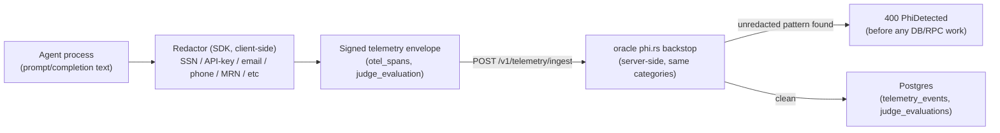

This page replaces the old wiki's `observability-vtl.md`/`phi.md`. It
documents the corrected, current design for how PHI/PII/secrets are kept
out of oracle storage — the design decided in this rewrite after
cross-checking prior Xibalba Solutions spec docs, not the old wiki's
speculative "Verifiable Trust Layer" (`GuardrailEngine`, `StateStore`
time-travel, a separate `integrity-observability-backend` service, a
`ReputationLedger`) — **none of that exists in this repo**; see the note at
the bottom.

## The real gap this design fixes

`integrity_sdk/integrations/openai_integrity.py` used to set
`GenAIAttributes.PROMPT`/`COMPLETION` (raw prompt/completion text) as OTel
span attributes with zero redaction. If a span like that were ever flushed
through `client.py`'s telemetry path to the oracle's
`POST /v1/telemetry/ingest`, raw agent content — for a healthcare-vertical
agent, actual PHI — would land in oracle storage. That is exactly the leak
this design exists to close, and it was live in already-shipped code.

## `Redactor` — targeted, not blanket masking (built, tested)

`integrity_sdk/security/redactor.py`, alongside the existing
`security/attestation.py`/`security/vault.py`. Performs **client-side**
masking of specific sensitive-content categories before any prompt/
completion text leaves the agent's process — not a blanket
hash-everything strip. An earlier draft of this component specified
exactly that blanket rule; it was wrong, because oracle-side LLM-as-judge
evaluation (below) needs structurally-intact, if-redacted trace content to
actually judge reasoning/tool-use shape — a blanket hash would make that
impossible.

Regex/heuristic categories matched today: `PRIVATE_KEY` (PEM blocks),
`API_KEY` (OpenAI `sk-...`, AWS `AKIA...`, `Bearer ...`), `SSN`,
`CREDIT_CARD`, `EMAIL`, `PHONE`, `MRN` (medical record number, labeled
convention). Each match is replaced with `[REDACTED:{CATEGORY}]`. **Honest
scope, stated in the source itself:** this is real, working masking for
common high-confidence cases — not a certified HIPAA Safe Harbor
18-identifier de-identification system, and it will miss PHI with no
structural marker (e.g. a patient's name in free text). This is why the
oracle-side backstop below exists.

Wired into the two named integrations: `openai_integrity.py` calls
`redact_text(...)` on prompt text, completion text (both streaming and
non-streaming), and streamed chunks *before* any span attribute is set or
[local-metrology](local-metrology.md) signals are derived from it;
`langchain_callback.py` redacts `text_output` and `reasoning_content` the
same way. Tested in `integrity-sdk/tests/unit/test_redactor.py` (clean
text passes through untouched; SSN/email/phone/credit-card/API-key
patterns are matched and masked).

**Real gap this page previously overstated, closed 2026-07-11**: this
section used to claim redaction was "wired into both instrumentation
paths" as if that were the complete picture. It wasn't — `telemetry/
tracing.py`'s `trace_run`/`traceable`/`client.traceable(...)` (the SDK's
own documented, *recommended* general-purpose tracing API, not one of the
two "instrumentation paths" this page was scoped to) captured a wrapped
function's raw arguments and return value with zero redaction. Any
consumer decorating their own LLM-calling function with
`@client.traceable(...)` — the normal, recommended way to use this SDK —
was forwarding raw, unredacted content toward the oracle. Fixed: a new
`_redact_value` helper in `tracing.py` recursively applies `redact_text`
to every string leaf in `TraceRun.set_outputs`'s value and
`_capture_inputs`'s captured arguments, however deeply nested. Tested in
the new `integrity-sdk/tests/unit/test_tracing.py` (previously zero
dedicated tests existed for this module at all).

## LLM-as-judge evaluation — storage/ingestion plumbing built; rubric `[PLANNED]`

`integrity-oracle/backend`'s `judge_evaluations` table now exists
(`migrations/0002_markets_and_judge.sql`: `id`, `agent_id` FK'd to `agents`,
`run_id`, `judge_model`, `verdict`, `score`, `rationale_summary`,
`telemetry_event_id`, `created_at`), and
`POST /v1/telemetry/ingest`'s `TelemetryIngestRequest` gained an optional
`judge_evaluation` field (`handlers::JudgeEvaluationDto`) that persists into
it when present. **Deliberately NOT part of the signed envelope** — the
`signable` JSON `ingest_telemetry` builds for
`crypto::verify_agent_signature` does not include `judge_evaluation`, so
adding one never retroactively breaks an already-signed payload from a
client that predates this field; it rides along as an unauthenticated
sidecar on an otherwise-authenticated request.

Still **`[PLANNED]`**: the actual judge implementation. There is no
`client.py` `submit_judge_evaluation(...)` SDK helper, and no judge
prompt/rubric anywhere in this repo — "Xibalba Solutions defines" the
rubric and it isn't specified yet. This pass built the storage +
ingestion plumbing only, exactly the scope asked for; not wired into the
[AIS](ais.md) formula in `scoring-core` (that would be its own weights/
formula decision requiring explicit sign-off).

## Oracle-side defense in depth — built

`POST /v1/telemetry/ingest` now independently rejects (`400`,
`AppError::PhiDetected`, real HTTP status — not a silent drop) any payload
carrying a recognized *unredacted* raw PHI/PII/secret pattern, via
`integrity-oracle/backend/src/phi.rs`. This mirrors (not reinvents)
`redactor.py`'s regex categories (`PRIVATE_KEY`, `API_KEY`, `SSN`,
`CREDIT_CARD`, `EMAIL`, `PHONE`, `MRN`) closely enough to be a real
backstop, not a decorative one — same intent per category, translated to
Rust's `regex` crate syntax. Runs first in the handler, before any DB/RPC
work, over every JSON **string** leaf in `otel_spans` plus the optional
`judge_evaluation` (numeric/structural fields are skipped — the SDK's
`Redactor` never touches those either, so scanning them would just
false-positive on values nobody was ever going to redact). Verified to
NOT re-flag the SDK's own `[REDACTED:{CATEGORY}]` output (a compliant,
already-redacted payload must pass). Unit-tested in `phi.rs` itself
(every category, the non-reflag case, the numeric/string scan boundary)
and exercised at the real HTTP layer in `tests/e2e.rs` (a raw SSN in an
otel span → real `400`, before signature verification even runs). The
oracle no longer relies solely on the SDK-side `Redactor` for this
invariant — belt and suspenders, as designed, not a substitute for it
(this is still regex/heuristic, not certified de-identification; a name
mentioned in free text with no structural marker still gets through both
layers).

## Dual-mode storage — `[PLANNED]`, bigger roadmap item

Mode 1 (transparent): full trace storage for non-regulated verticals,
prioritizing developer debugging visibility. Mode 2 (Sovereign ZK-mode, for
Shield/healthcare and any PHI-adjacent vertical): raw content never leaves
local hardware at all — only a hash and a [ZK proof](zkp.md) of correct
measurement leave the agent's process. Not built as a toggle; tracked in
the root `README.md`'s "Vision & long-term roadmap" section.

## What this page does NOT claim (correcting the old wiki)

The old wiki's `observability-vtl.md` described a `Trace Aggregator`, a
`Risk Analyzer` (privilege escalation / agentic loop / hallucination
detection), a `GuardrailEngine` with pluggable `BaseGuardrail` classes, a
`StateStore` supporting agent-state "time travel" (rewind/edit/fork), a
`ReputationLedger`, and a standalone `integrity-observability-backend`
service. **None of these exist in `integrity-sdk` or `integrity-oracle`
today.** Only the `Redactor` and the (not-yet-built) judge-evaluation
ingestion path are real/planned per the current design; treat the rest of
that old page as unbuilt product ideation, not documentation.

Related: [local metrology](local-metrology.md), [AIS](ais.md),
[ComplianceGate](compliance-gate.md), [integrity-sdk](../entities/integrity-sdk.md),
[AIS API — Versioned Wire Spec](ais-api-spec.md) (the telemetry-envelope
signing fix that made this pipeline actually reach the oracle for the
first time is documented there and on [integrity-oracle](../entities/integrity-oracle.md)).
