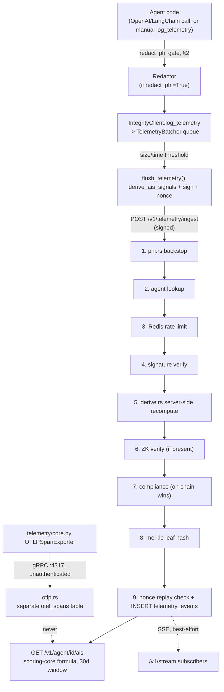

This page is the end-to-end reference for how an agent's behavior becomes a
stored, scored `telemetry_events` row in [integrity-oracle](../entities/integrity-oracle.md)
— from the SDK call that captures one inference, through batching, signing,
the oracle's ordered request pipeline, to the [AIS](ais.md) formula reading
the result. It ties together three pages that each own one deep-dive slice
(don't duplicate their detail here, link to it): [Local Metrology](local-metrology.md)
(the exact entropy/grounding/sacrifice/compliance formulas),
[AIS](ais.md) (the scoring formula + the oracle's server-side
re-derivation trust model), and [Observability & PHI Safety](observability-vtl.md)
(the `Redactor` categories). This page is the connective tissue: collection
surfaces, batching, the wire format, and the oracle's request pipeline in
the exact order it actually runs.

**There are two completely separate telemetry paths in this repo — do not
conflate them:**

| | The scored path (this page) | The OTLP/gRPC path |
|---|---|---|
| Entry point | `IntegrityClient.flush_telemetry()` → `POST /v1/telemetry/ingest` | `telemetry/core.py::init_telemetry`'s real `OTLPSpanExporter`/`OTLPMetricExporter` → gRPC `localhost:4317` |
| Authenticated? | Yes — Ed25519-signed envelope | **No** — real OTLP protobuf, no signature envelope at all |
| Feeds AIS? | Yes — this is the only path that does | **No, by design** — see `otlp.rs`'s module doc: feeding unauthenticated spans into scoring would let anyone move an agent's score |
| Storage | `telemetry_events` (scored) | a separate `otel_spans` table (own migration, unauthenticated) |
| Handler | `handlers::ingest_telemetry` | `otlp.rs`'s `TraceService`/`MetricsService` gRPC impls |

Confusingly, `TelemetryIngestRequest.otel_spans` (a JSON array field on the
*signed* request) and the OTLP path's `otel_spans` *table* share a name but
are unrelated — the field is the SDK's own batched `log_telemetry`/
`traceable` entries (never real OTel protobufs), described throughout this
page. Metrics export on the OTLP path is accepted but not yet parsed or
persisted (`OtlpMetricsService::export`'s own doc comment) — traces are.

## 1. Collection surfaces (SDK side)

Every surface below ultimately calls `IntegrityClient.log_telemetry(metadata, *, entropy=None, grounding=None)`, which just appends `{"metadata": ..., "entropy": ..., "grounding": ...}` to an in-memory queue — no network call, no blocking of the agent's hot path.

| Surface | What it captures | Redaction |
|---|---|---|
| `integrations/openai_integrity.py` (`IntegrityOpenAI`, drop-in `OpenAI` subclass) | Both streaming and non-streaming `chat.completions`. Prompt/completion text, `model_requested`/`model_actual`, `system_fingerprint`, `service_tier`, token usage, `ttft_ms`/`token_jitter_ms`/`tokens_per_sec`, `tool_calls` (names only — never `function.arguments`), `conversation_length` (`len(messages)`), and — as of 2026-07-15 — a real failure path (`type(exception).__name__` as `error_taxonomy`, since a call that raises before any response exists still gets logged) | `redact_phi` constructor param, see §2 |
| `integrations/langchain_callback.py` (`IntegrityLangChainCallback`) | `on_llm_start`/`on_chat_model_start`/`on_llm_end`/`on_llm_error` callback hooks. `text_output`, `reasoning_content` (`additional_kwargs.reasoning_content`), `token_usage`, `model_name`, `system_fingerprint` (when the underlying provider surfaces it in `llm_output`), `llm_class` (the serialized LangChain class path), `tool_calls` (names only), `conversation_length`, `error`/`error_taxonomy` | `redact_phi` constructor param, see §2 |
| `telemetry/tracing.py`'s `trace_run`/`traceable`/`client.traceable(...)` | The SDK's own general-purpose, recommended tracing API — wraps an arbitrary function, captures its arguments and return value as a `TraceRun`. Rides the same flush pipeline as `trace_run`-tagged entries (see §5). Redacts every string leaf recursively (`_redact_value`), regardless of nesting depth in dicts/lists — this is unconditional here, not gated by a `redact_phi` flag the way the two named integrations are | Always on |
| `client.record_metric(name, value, tags=None)` / `define_metric(...)` | Open-ended named-metric escape hatch (`telemetry/metrics.py`'s `MetricsRegistry`) for anything beyond the four fixed AIS signals — e.g. `IntentInvocation.record_outcome`'s plan-adherence score. Drained into the same flush's `otel_spans` array, tagged `"kind": "custom_metrics"` | N/A (numeric only) |
| `client.invoke_intent(...)` | Pre-execution BCC commitment capture — opens a span *before* the caller's actual execution code runs, records a `trace_run`-shaped entry. A completely separate concern from telemetry scoring (it's the [BCC](bcc.md) pre-execution gate), but its trace entry rides this same flush pipeline | Via `trace_run`'s unconditional redaction above |

## 2. Redaction gate (`redact_phi`) — real behavior change, 2026-07-15

`security/redactor.py`'s `redact_text()` performs targeted (not blanket) masking of `PRIVATE_KEY`/`API_KEY`/`SSN`/`CREDIT_CARD`/`EMAIL`/`PHONE`/`MRN` patterns — see [Observability & PHI Safety](observability-vtl.md) for the regex categories and the full design rationale.

**As of 2026-07-15, both `IntegrityOpenAI` and `IntegrityLangChainCallback` accept a `redact_phi: bool` constructor param that defaults to `False`.** This is a real, deliberate behavior change from the prior posture (redaction ran unconditionally in both integrations). The decision:

- Redaction is now opt-in, scoped to Xibalba Shield / healthcare-vertical agents — a trading/prediction-market/capital-allocation agent has no PHI exposure at all, and defaulting to redaction everywhere cost fidelity on captured text project-wide with no compliance benefit for those verticals.
- **Any Shield / healthcare-vertical agent MUST pass `redact_phi=True` explicitly.** Neither wrapper has any way to know an agent's `compliance_vertical` on its own (that's registered separately, via `registration.py`) — nothing here can safely auto-detect "this needs redaction."
- Both wrappers log a `logger.warning(...)` naming the agent at construction time whenever `redact_phi` is left at its default `False`, so a misconfigured deployment is at least loud about it.
- **There is no runtime enforcement.** Nothing currently prevents a healthcare-vertical agent from being constructed without `redact_phi=True` — this is a real, accepted residual risk from the chosen default, tracked in `PRODUCTION_GAPS.md` §3, not an oversight. `telemetry/tracing.py`'s `traceable`/`trace_run` API is unaffected by this flag and always redacts (see §1's table) — only the two named integrations gained the toggle.
- The oracle-side PHI backstop (`phi.rs`, §7 step 1 below) is unconditional regardless of `redact_phi` — it will `400` a payload carrying an unredacted pattern either way, whether or not the client opted into client-side redaction. This is the actual safety net for a misconfigured `redact_phi=False` healthcare deployment today, not a substitute for fixing the SDK-side default.

## 3. Signal derivation

`telemetry/derive.py`'s `derive_ais_signals(batch, ...)` computes the four AIS input signals (entropy, grounding, sacrifice, compliance, all normalized `[0.0, 1.0]`, 1.0 = best) from the batch about to be flushed. Full formulas: [Local Metrology](local-metrology.md). One fact worth repeating here because it changes how to read §7 below: **the oracle does not trust this computation** — it independently re-derives entropy/grounding/sacrifice/self-reported-compliance server-side from the same raw content (`backend/src/derive.rs`), and only the oracle's numbers become the actual scoring inputs. `derived_signals` (this section's output) still rides in the signed envelope and is stored, but purely as an audit-trail comparison — see [AIS](ais.md) for the full trust-model writeup and the real e2e test proving an inflated client claim gets overridden.

## 4. Client-side batching (`batcher.py`)

`TelemetryBatcher` is a plain in-memory queue behind a `threading.Lock`, no persistence:

- `add_telemetry(data)` appends.
- `should_flush()` is true once `len(queue) >= batch_size_limit` (default 50) **or** `time.time() - last_flush >= flush_interval_sec` (default 5.0s) with a non-empty queue.
- `get_batch_and_clear()` drains up to `batch_size_limit` items, leaving overflow queued for next cycle (bounds a single flush's payload size rather than growing it unboundedly if the oracle is slow/down).

`IntegrityClient.log_telemetry` checks `should_flush()` after every append and calls `flush_telemetry()` automatically when `auto_flush=True` (the default) — a caller normally never calls `flush_telemetry()` directly except at shutdown to drain a final partial batch.

## 5. Nonce lifecycle

Every flush carries a strictly-increasing per-agent `nonce` (`i64`), checked by the oracle for replay protection (§7 step 6). This is a **separate counter space** from the BCC commitment nonce (`bcc.NonceStore`) — conflating them would let a used-up BCC nonce block an unrelated telemetry flush or vice versa (`docs/INTERFACE_CONTRACT.md` keeps them distinct).

- A fresh `IntegrityClient` starts at `self._nonce = 0` and `_nonce_synced = False`.
- Before the *first* real flush, `_sync_nonce_from_oracle()` fetches `GET /v1/agent/{id}` and adopts its `last_nonce` if higher than 0 — otherwise a client restarted after a process crash would replay a nonce an earlier instance already consumed, forever. Best-effort: a failed sync (oracle unreachable, agent not yet registered) is logged and swallowed, and `_nonce_synced` is still marked `True` so a persistently-down oracle doesn't pay a redundant `GET` on every flush.
- `flush_telemetry()` increments `self._nonce` *before* sending.
- On success: nothing further needed, the incremented value is now current.
- On any POST failure that is **not** a 409: the drained batch is re-queued (so it's included in the next flush) and `self._nonce` is rolled back by 1, so the retry reuses the same nonce value.
- On a **409** specifically: the oracle is telling the client this exact nonce was *already* consumed (a genuinely different failure mode than "the request never landed") — rolling back and reusing it would just repeat the same 409 forever. Instead `_nonce_synced` is reset to `False` and `_sync_nonce_from_oracle()` runs again, so the *next* flush actually advances past the real server-side value.

## 6. Signing & wire format

`flush_telemetry()` builds the signable object, canonicalizes it, and signs:

```python
signable = {
    "agent_id": self.agent_id,
    "nonce": self._nonce,
    "otel_spans": otel_spans,       # see below
    "derived_signals": derived,     # from derive_ais_signals()
    "zk_proof": zk_proof,           # optional, caller-supplied
}
signature = "0x" + keypair.sign(bcc.canonical_json_bytes(signable)).hex()
payload = {**signable, "signature": signature}
```

- **Canonicalization**: `bcc.canonical_json_bytes` — `json.dumps(obj, sort_keys=True, separators=(",", ":"), ensure_ascii=True)`, the same convention used across `bcc.py` and mirrored on the oracle side by `crypto::canonical_json_bytes` (a Rust formatter that had to be custom-written to match `ensure_ascii=True`'s non-ASCII-escaping behavior — `serde_json`'s default does not escape non-ASCII, which was a real cross-language signature mismatch bug, fixed; see [integrity-oracle](../entities/integrity-oracle.md)). **Known residual gap**, not yet exercised by any test: the fix covers the two sides agreeing on *escaping*, but non-ASCII content flowing through this pipeline is still a narrower theoretical disagreement surface — flagged, not silently assumed fine.
- **Signature**: raw 64-byte Ed25519 (`did.py`'s `Keypair.sign`), hex-encoded with a `0x` prefix. Without a `keypair=` at `IntegrityClient` construction, `signature` is sent as an empty string — this still *deserializes* on the oracle side (the field is a required `String`, not `Option<String>`) but the oracle's signature check then honestly `401`s it, handled by the same retry/re-queue path as any other failure.
- **`otel_spans`**: one flat, tagged JSON array — `{"kind": "telemetry", ...entry}` for each `log_telemetry` call in the batch, `{"kind": "trace_run", ...run}` for each finished `traceable`/`trace_run`, and (if any custom metrics were recorded) one `{"kind": "custom_metrics", "metrics": [...]}` element. The oracle stores this column as opaque `JSONB` and never destructures by tag — the tag is for a human/future-code reader distinguishing origins, not a schema requirement. **This was previously sent as a JSON object** (`{"telemetry": [...], "trace_runs": [...]}`), which Axum's JSON extractor rejected outright since the oracle's struct types it `Vec<serde_json::Value>` — every telemetry flush this SDK ever sent to a real oracle would have failed before that fix.

Optional args to `flush_telemetry(zk_proof=, compliance_gate_address=, covered_entity_address=, w3=)` thread through to `derive_compliance`'s on-chain "wins" check (§3) when the caller has chain access available.

## 7. Oracle ingestion pipeline (`handlers::ingest_telemetry`)

`POST /v1/telemetry/ingest` runs a fixed, ordered sequence — cheapest/most-certain-to-reject-fast first, matching this monorepo's general pipeline-ordering convention (same shape as `bcc_middleware`'s `run_intercept`):

1. **PHI/PII/secret backstop** (`phi::scan_json_value`, `phi.rs`) — scans every JSON string leaf in `otel_spans` plus the optional `judge_evaluation` for a raw, unredacted pattern (mirrors `Redactor`'s categories in Rust `regex` syntax). Any hit → `400 PhiDetected` immediately, **before any DB or RPC work** — a malformed/bypassed-redaction payload fails as fast as possible. This runs unconditionally regardless of the SDK's `redact_phi` setting (§2) — it's the real backstop for that flag defaulting to `False`.
2. **Agent lookup** (`db::get_agent`) — `404 AgentNotFound` if `agent_id` isn't registered.
3. **Rate limit** (`check_telemetry_rate_limit`) — a Redis fixed-window counter, `INCR ratelimit:telemetry:{agent_id}:{unix_minute}` with a 60s expiry set on first increment of a window. `429` over `telemetry_rate_limit_per_minute` (config). A fixed window, not a token bucket — the accepted tradeoff is bursting up to 2× the limit at a window boundary, in exchange for not needing token-bucket state.
4. **Signature verification** (`crypto::verify_agent_signature`) — rebuilds the exact `signable` object (§6) from the typed request struct (everything except `signature` and `judge_evaluation`), canonicalizes it the same way, and checks against the agent's stored `ed25519_pubkey` **or** `eth_address` (both verification methods are supported — see `AgentVerificationMethods`). `401` on failure.
5. **Server-side signal re-derivation** (`derive::recompute`, `backend/src/derive.rs`) — runs immediately after signature verification (so an unauthenticated request never triggers this work) and before the ZK check. Independently recomputes entropy/grounding/sacrifice from `otel_spans`' raw content — full detail and trust-model rationale: [AIS](ais.md). Compliance is derived separately (`oracle_compliance`, below) since it needs live chain access the pure-function `derive::recompute` doesn't have.
6. **ZK proof check** — if `zk_proof` is present, `state.zk.verify(circuit_id, proof_bytes, public_inputs_bytes)` against the real Barretenberg verifier (see [ZKP](zkp.md)); absent → `zk_verified = false`, not an error.
7. **Compliance derivation** (`oracle_compliance`) — mirrors `derive.py::derive_compliance`'s "on-chain wins" logic, but runs **unconditionally** here rather than as an SDK-side opt-in a caller could forget to pass. Falls back to the self-reported flagged-ratio whenever the agent's primitives aren't cached, no `covered_entity_address` was supplied in `otel_spans`' metadata, or the chain read fails — never errors, since this computes a scoring input, not a security gate ([ComplianceGate](compliance-gate.md) remains the real, fail-closed PHI-access enforcement point).
8. **Merkle leaf hash** — `keccak256` over `telemetry_leaf_data(agent_id, nonce, payload_hash)` (see [Merkle Batching](merkle-batching.md) for the hashing convention). Stored on the row; **actual on-chain anchoring of this leaf happens out-of-band**, per-agent, in `bcc_middleware/app/anchor.py` — not via a root assigned back onto this row by the oracle itself.
9. **Nonce replay check + insert** (`db::insert_telemetry_event`) — inside one transaction: `SELECT last_nonce FROM agents WHERE id = $1 FOR UPDATE` (row lock, so two concurrent flushes for the same agent can't both pass the check against a stale value), then `nonce <= last_nonce` → `409` (`InsertTelemetryError::NonceReplay`) before any insert. Otherwise inserts into `telemetry_events` with the **oracle's own recomputed** `performance_variance` (polarity-corrected: `1.0 - recompute.entropy`, see [AIS](ais.md) for why), `hgi_raw` (= recomputed grounding), `gpu_hours_verified` (= recomputed sacrifice, an hours-equivalent proxy — see `derive.rs`'s doc comment for why this differs from the SDK's own `[0,1]`-normalized index), `flagged` (from the oracle-computed compliance, not the client's claim), `zk_verified`, `leaf_hash`, and the full `payload` JSONB (`otel_spans`, both the client's `derived_signals` claim *and* the oracle's `oracle_recomputed_signals`, `zk_proof`).
10. **Judge evaluation** (optional) — if `judge_evaluation` was present, persisted into `judge_evaluations`, linked via the new event's id. Storage/ingestion plumbing only — no judge/rubric implementation exists in this repo (`[PLANNED]`, see [Observability & PHI Safety](observability-vtl.md)). Deliberately **not** part of the signed envelope, so adding it never requires re-signing.
11. **Live push** — if `state.telemetry_tx` has any subscribers, a `TelemetryEvent` frame is broadcast over SSE (`GET /v1/stream`), and (best-effort — a send failure just means zero listeners) an up-to-date `AisUpdate` is computed and pushed too, via the same `compute_ais_for_agent` function `GET /v1/agent/{id}/ais` calls directly, so a pushed score can never drift from a direct read.

Response (`TelemetryIngestResponse`): `event_id`, `leaf_hash`, `zk_verified`, `flagged`.

## 8. AIS computation

`GET /v1/agent/{id}/ais` aggregates every `telemetry_events` row for the agent over a trailing **30-day** window (`AIS_REPORTING_PERIOD_DAYS`, default 30) — `AVG(performance_variance)`, `AVG(hgi_raw)`, `SUM(gpu_hours_verified)`, `AVG(flagged::0/1)` as the penalty ratio, `BOOL_OR(zk_verified)` — then applies `scoring-core`'s formula. Full formula, weights, and the component-score curve shapes: [AIS](ais.md).

## 9. Read-side API surface

```
POST /v1/telemetry/ingest                    the path this page documents
GET  /v1/agent/{id}/ais                       current AIS + component breakdown
GET  /v1/agent/{id}/ais/history               time-bucketed AIS history
GET  /v1/agent/{id}/telemetry                  raw telemetry_events history
GET  /v1/agent/{id}/telemetry/volume           time-bucketed event counts
GET  /v1/agent/{id}/otel/volume                time-bucketed OTLP span counts (separate path, §0 table)
GET  /v1/agent/{id}/traces                     judge_evaluations for this agent
GET  /v1/traces/{trace_id}                     reconstructed span tree for one trace
GET  /v1/agent/{id}/compliance                 live ComplianceGate read
GET  /v1/stream                                 SSE: TelemetryEvent/OtelSpan/AisUpdate, all agents
GET  /v1/agent/{id}/stream                      SSE: same, filtered to one agent
```

## 10. Known gaps (honest, not silently assumed fine)

- **No runtime enforcement of `redact_phi=True` for healthcare agents** (§2) — a real, accepted residual risk from the 2026-07-15 default change, tracked in `PRODUCTION_GAPS.md` §3.
- **Non-ASCII canonicalization** — the escaping mismatch between Python's `ensure_ascii=True` and Rust's default was fixed, but non-ASCII telemetry content flowing through this exact pipeline isn't covered by any current test (§6).
- **ZK boost is period-wide, not per-event** — a single verified proof anywhere in the 30-day window boosts the *average* of every event in it, not bound to a specific event's claim (see [AIS](ais.md)'s "Still open" section).
- **`gpu_hours_verified` is a token-usage proxy, not independently verified compute** — despite the field name, no such measurement exists in this protocol yet (`scoring-core`'s own field doc is explicit about this).
- **OTLP path is unauthenticated by design** (§0) — real spans, but no signature envelope; never treat `GET /v1/agent/{id}/otel/volume` data as tamper-evident the way `telemetry_events` is.



Related: [Local Metrology](local-metrology.md), [AIS](ais.md),
[Observability & PHI Safety](observability-vtl.md), [Behavioral Commitment Chain](bcc.md),
[Merkle Batching & Anchoring Convention](merkle-batching.md),
[integrity-sdk](../entities/integrity-sdk.md), [integrity-oracle](../entities/integrity-oracle.md).
