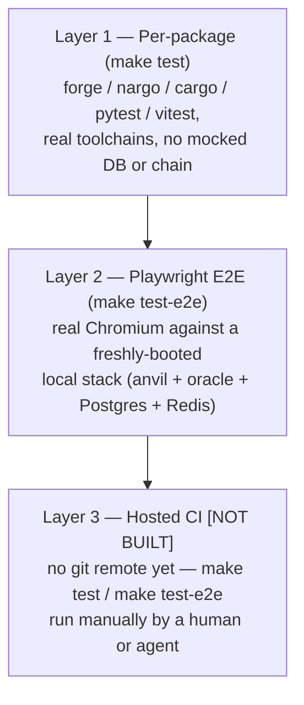

The full picture — per-package unit/integration tests, `integrity-mvp`'s
component tests, and the new real-browser E2E layer — lives in
[`docs/TESTING.md`](../../TESTING.md); this page is the wiki's pointer into
it plus the facts worth having in the knowledge graph directly.

## Three layers

1. **Per-package** (`make test`): `forge test` (contracts, 165), `nargo
   test` (integrity-zkp), `cargo test` (integrity-oracle, 54 backend +
   scoring-core lib + real e2e), `pytest` (integrity-sdk 97, integrity-cli
   57, bcc_middleware 75+28 OPA, integrity-userapi 33 against a real
   Postgres), `npm test`/vitest (integrity-mvp, real components +
   `msw`-mocked HTTP boundary).
2. **Playwright E2E** (`make test-e2e`, new 2026-07-09): a real Chromium
   browser against the real `integrity-mvp` app, talking to a real,
   freshly-booted local stack (`integrity-mvp/e2e/global-setup.ts`: a
   dedicated local anvil + real genesis/market deploy, ephemeral
   Postgres+Redis, a real `integrity-oracle` instance, one real seed agent
   registered through the real SDK flow). Local anvil only — never live
   Base Sepolia, for speed/cost/determinism (mirrors the convention
   [Integrity SDK](../entities/integrity-sdk.md)'s and
   [Integrity Oracle](../entities/integrity-oracle.md)'s own test suites
   already use).
3. **Not yet built**: hosted CI. This repo has no git remote today, so
   there's nothing for GitHub Actions to trigger from — `make test`/`make
   test-e2e` run by a human or agent are the enforcement mechanism until
   that changes (see `.agents/AGENTS.md` §6). An honest, documented gap.

## Ground rule

No silent mocks, at every layer. `msw` in `integrity-mvp`'s vitest suite is
the one deliberate mock in the whole pyramid, scoped to exactly the HTTP
boundary — the Playwright layer exists specifically to prove the real
request/response actually works, which the mocked layer can't.

## Convention going forward

As [integrity-mvp](../entities/integrity-mvp.md)'s dashboard pages get
built out (task #21 — Markets, Leaderboard, Wallet, Capital Allocation,
Cognition, Identity, Shield, Landing), each page's Playwright spec ships in
the same pass as the page, not backfilled later.
