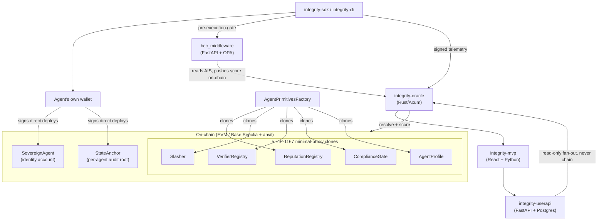

# Integrity Protocol Wiki

Compiled knowledge base for the Integrity Protocol monorepo — a trust/
compliance layer for AI agents on Base L2. This page is the map; every
section below links to the real page. Governance/conventions:
`WIKI_SCHEMA.md` (page format), `WIKI_INDEX.md` (the full catalog with
one-line descriptions — the canonical index this page summarizes),
`WIKI_LOG.md` (chronological history, append-only). Cross-package
decisions live in `../INTERFACE_CONTRACT.md`; how this wiki gets kept in
sync with the code is `../../.agents/AGENTS.md`.

**Start here** if you're new: [Agent Primitives](concepts/agent-primitives.md)
(the 7 per-agent contracts every other page assumes you understand), then
[AIS](concepts/ais.md) (the trust score) and
[Telemetry Ingestion Pipeline](concepts/telemetry-ingestion.md) (how
agent behavior becomes that score).

## System at a glance

## Table of contents

### Concepts — identity & on-chain primitives
- [Agent Primitives (Self-Sovereign Identity)](concepts/agent-primitives.md) — the 7 per-agent contracts; **start here**
- [Decentralized Identifier (DID)](concepts/did.md)
- [Identity Ceiling & Verification Ladder](concepts/identity-ceiling.md) — `[PARTIALLY BUILT]`

### Concepts — trust & scoring
- [Agent Integrity Score (AIS)](concepts/ais.md) — the formula + oracle's server-side re-derivation trust model
- [Telemetry Ingestion Pipeline](concepts/telemetry-ingestion.md) — end-to-end: SDK collection → batching → signing → the oracle's 11-step ordered pipeline → AIS
- [Local Metrology](concepts/local-metrology.md) — the exact entropy/grounding/sacrifice/compliance formulas
- [Observability & PHI Safety Pipeline](concepts/observability-vtl.md) — the `Redactor`, `redact_phi`, the oracle-side PHI backstop

### Concepts — behavioral gating & cryptography
- [Behavioral Commitment Chain (BCC)](concepts/bcc.md) — the pre-execution signed-intent gate
- [Merkle Batching & Anchoring Convention](concepts/merkle-batching.md)
- [Zero-Knowledge Proving Pipeline (ZKP)](concepts/zkp.md)

### Concepts — compliance & markets
- [ComplianceGate & Xibalba Shield](concepts/compliance-gate.md) — the HIPAA/healthcare vertical
- [Smart BAA](concepts/smart-baa.md) — on-chain Business Associate Agreement escrow
- [Integrity Market](concepts/integrity-market.md) — prediction markets, binary options, A2A capital allocation

### Concepts — wire spec & testing
- [AIS API — Versioned Wire Spec](concepts/ais-api-spec.md) — the generated, externally-supported `/v1/*` spec
- [Testing Strategy](concepts/testing-strategy.md) — the 3-layer test pyramid

### Concepts — planned / design-only
- [Identity Ceiling & Verification Ladder](concepts/identity-ceiling.md) — `[PARTIALLY BUILT]`
- [Cross-Chain Reputation Sync](concepts/cross-chain-spec.md) — `[PLANNED]`
- [A2A Negotiation Protocol](concepts/a2a-negotiation-spec.md) — `[PLANNED]`
- [ZK-ML Model-Inference Verification](concepts/zk-ml-spec.md) — `[PLANNED]`

### Entities — one page per real package
- [contracts](entities/contracts.md) — Solidity/Foundry: the 7 primitives, factory, registries, XNS, Shield, market layer, $ITK
- [integrity-oracle](entities/integrity-oracle.md) — Rust/Axum: AIS scoring, server-side telemetry re-derivation, on-chain reads, markets/leaderboard
- [integrity-sdk](entities/integrity-sdk.md) — Python agent library: identity, BCC, markets, telemetry, PHI redaction
- [integrity-cli](entities/integrity-cli.md) — developer CLI, independent reimplementation of the SDK's core flows
- [bcc_middleware](entities/bcc_middleware.md) — FastAPI + OPA pre-execution policy gate + reputation-sync loop
- [integrity-userapi](entities/integrity-userapi.md) — FastAPI + Postgres user accounts/auth, strictly non-chain
- [integrity-mvp](entities/integrity-mvp.md) — the React/Vite dashboard + `demo/` scenario engine
- [integrity-zkp](entities/integrity-zkp.md) — the real Noir/Barretenberg circuit

### Guides
- [Smart Contract Development](../guides/smart-contract-development.md) — writing/testing/deploying a new contract
- [Multi-Domain Guardrails Design](../guides/multi-domain-guardrails-design.md) — `[DESIGN, PARTIALLY BUILT]`

### Reference
- [WIKI_INDEX.md](WIKI_INDEX.md) — full catalog, one-line description per page (the canonical index)
- [WIKI_LOG.md](WIKI_LOG.md) — chronological record of every wiki change, append-only
- [WIKI_SCHEMA.md](WIKI_SCHEMA.md) — page format, frontmatter, tag taxonomy

### Open queries
- No LLM-as-judge rubric exists anywhere in this repo — the `judge_evaluations`
  ingestion schema is built but the scoring rubric is an open product
  question. See [Observability & PHI Safety](concepts/observability-vtl.md).

## Acronym glossary
- **AIS** — Agent Integrity Score → [concepts/ais.md](concepts/ais.md)
- **BAA** — Business Associate Agreement → [concepts/smart-baa.md](concepts/smart-baa.md)
- **BCC** — Behavioral Commitment Chain → [concepts/bcc.md](concepts/bcc.md)
- **DID** — Decentralized Identifier → [concepts/did.md](concepts/did.md)
- **VTL** — (old term) Verifiable Trust Layer → see [Observability & PHI Safety](concepts/observability-vtl.md) for what's actually built
- **ZKP** — Zero-Knowledge Proof(ing pipeline) → [concepts/zkp.md](concepts/zkp.md)

## No aspirational content

Every page here documents what exists in the code right now. A feature
described in a spec but not yet implemented is explicitly marked
`[PLANNED]` or `[DESIGN, PARTIALLY BUILT]` in its title/index entry — never
written as if it's real. See `WIKI_SCHEMA.md` for the full convention.
