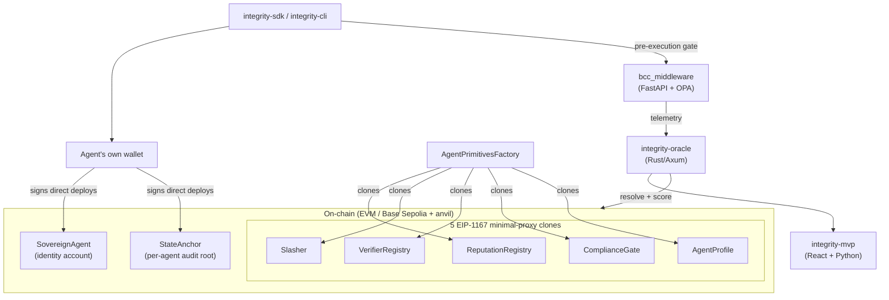

# Integrity Protocol Wiki

Compiled knowledge base for the Integrity Protocol monorepo — start at
[WIKI_INDEX.md](WIKI_INDEX.md) for the full content catalog, or jump to a
concept: [AIS](concepts/ais.md) · [BCC](concepts/bcc.md) · [DID](concepts/did.md) · [ZKP](concepts/zkp.md).

See `../INTERFACE_CONTRACT.md` for the binding cross-package contract this
wiki documents, and `../../.agents/AGENTS.md` for how this wiki gets kept in
sync with the code.

## System at a glance

See [concepts/ais.md](concepts/ais.md) for the AIS scoring flow diagram and
[entities/](entities/) for a per-package breakdown.
